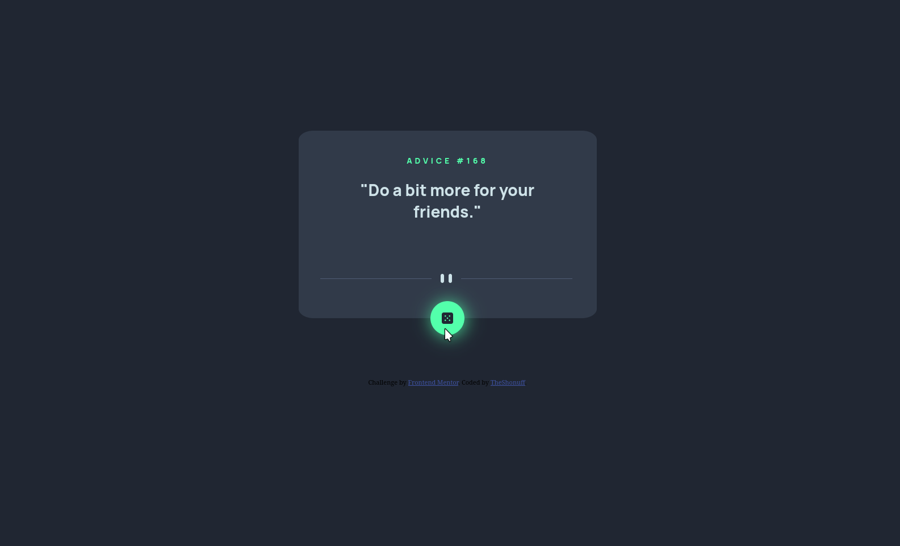

# Frontend Mentor - Advice generator app solution

This is a solution to the [Advice generator app challenge on Frontend Mentor](https://www.frontendmentor.io/challenges/advice-generator-app-QdUG-13db). Frontend Mentor challenges help you improve your coding skills by building realistic projects.

## Table of contents

- [Overview](#overview)
  - [The challenge](#the-challenge)
  - [Screenshot](#screenshot)
  - [Links](#links)
- [My process](#my-process)
  - [Built with](#built-with)
  - [What I learned](#what-i-learned)
  - [Continued development](#continued-development)

- [Author](#author)

**Note: Delete this note and update the table of contents based on what sections you keep.**

## Overview

### The challenge

Your challenge is to build out this advice generator app using the [Advice Slip API](https://api.adviceslip.com) and get it looking as close to the design as possible.

You can use any tools you like to help you complete the challenge. So if you've got something you'd like to practice, feel free to give it a go.

Your users should be able to:

- View the optimal layout for the app depending on their device's screen size
- See hover states for all interactive elements on the page
- Generate a new piece of advice by clicking the dice icon

- 

### Screenshot

### Links

- Solution URL: [Add solution URL here](https://your-solution-url.com)
- Live Site URL: [Add live site URL here](https://your-live-site-url.com)

## My process

Still developing a "process." However I blocked most of what I need in html and css first. Then I added the javascript in slowly building the fetch request. I followed the request with a lot of console.log() to see how the data was being handled.

### Built with

- Semantic HTML5 markup
- CSS custom properties
- Flexbox
- Mobile-first workflow
- Vanilla JS

**Note: These are just examples. Delete this note and replace the list above with your own choices**

### What I learned

I learned how to fetch a JSON object from a url and not save a cache so I can load in new requests. Still trying to find my way around CSS and media quieries without constantly breaking my layout. 

### Continued development

Need to continue practicing my CSS fu and Javascript skills. I might have had an easier time if I learn a js framework but I've decided to master vanilla JS first.

## Author

- Website - [The Shonuff](https://www.thedudeway.com)
- Frontend Mentor - [@yourusername](https://www.frontendmentor.io/profile/TheShonuff)

